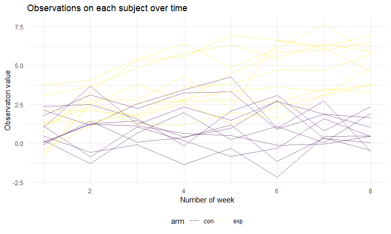
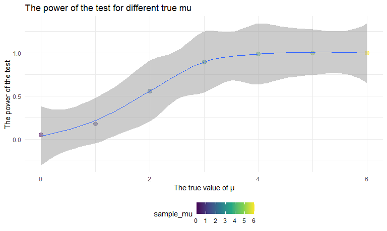
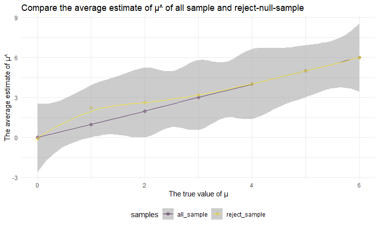

Homework 5
================
Liner Ge
2020/11/14

``` r
library(tidyverse)
```

    ## -- Attaching packages -------------------------------------- tidyverse 1.3.0 --

    ## √ ggplot2 3.3.2     √ purrr   0.3.4
    ## √ tibble  3.0.3     √ dplyr   1.0.2
    ## √ tidyr   1.1.2     √ stringr 1.4.0
    ## √ readr   1.3.1     √ forcats 0.5.0

    ## -- Conflicts ----------------------------------------- tidyverse_conflicts() --
    ## x dplyr::filter() masks stats::filter()
    ## x dplyr::lag()    masks stats::lag()

``` r
library(rvest)
```

    ## Loading required package: xml2

    ## 
    ## Attaching package: 'rvest'

    ## The following object is masked from 'package:purrr':
    ## 
    ##     pluck

    ## The following object is masked from 'package:readr':
    ## 
    ##     guess_encoding

``` r
set.seed(1)

knitr::opts_chunk$set(
  fig.height = 8,
  fig.width = 8,
  fig.asp = .6,
  out.width = "90%"
)

theme_set(theme_minimal() + theme(legend.position = "bottom"))

options(
  ggplot2.continuous.colour = "viridis",
  ggplot2.continuous.fill = "viridis"
)

scale_colour_discrete = scale_colour_viridis_d
scale_fill_discrete = scale_fill_viridis_d
```

## Problem 1

Read in the data.

``` r
homicide_df = 
  read_csv("data/homicide-data.csv") %>% 
  mutate(
    city_state = str_c(city, state, sep = "_"),
    resolved = case_when(
      disposition == "Closed without arrest" ~ "unsolved",
      disposition == "Open/No arrest"        ~ "unsolved",
      disposition == "Closed by arrest"      ~ "solved"
    )
    
  ) %>% 
  select(city_state, resolved) %>% 
  filter(city_state != "Tulsa_AL")
```

    ## Parsed with column specification:
    ## cols(
    ##   uid = col_character(),
    ##   reported_date = col_double(),
    ##   victim_last = col_character(),
    ##   victim_first = col_character(),
    ##   victim_race = col_character(),
    ##   victim_age = col_character(),
    ##   victim_sex = col_character(),
    ##   city = col_character(),
    ##   state = col_character(),
    ##   lat = col_double(),
    ##   lon = col_double(),
    ##   disposition = col_character()
    ## )

Let’s look at this a bit

``` r
aggregate_df =
  homicide_df %>% 
  group_by(city_state) %>% 
  summarize(
    hom_total = n(),
    hom_unsolved = sum(resolved == "unsolved")
  )
```

    ## `summarise()` ungrouping output (override with `.groups` argument)

Can I do a prop test for a single city?

``` r
prop.test(
  aggregate_df %>% filter(city_state == "Baltimore_MD") %>% pull(hom_unsolved),
  aggregate_df %>%  filter(city_state == "Baltimore_MD") %>% pull(hom_total)
  
) %>% 
  broom::tidy()
```

    ## # A tibble: 1 x 8
    ##   estimate statistic  p.value parameter conf.low conf.high method    alternative
    ##      <dbl>     <dbl>    <dbl>     <int>    <dbl>     <dbl> <chr>     <chr>      
    ## 1    0.646      239. 6.46e-54         1    0.628     0.663 1-sample~ two.sided

Try to iterate…

``` r
results_df = 
  aggregate_df %>% 
  mutate(
    prop_tests = map2(.x = hom_unsolved, .y = hom_total, ~ prop.test(x = .x, n = .y)),
    tidy_tests = map(.x = prop_tests, ~ broom::tidy(.x))
  ) %>% 
  select(-prop_tests) %>% 
  unnest(tidy_tests)
```

``` r
results_df %>% 
  mutate(city_state = fct_reorder(city_state, estimate)) %>% 
  ggplot(aes(x = city_state, y = estimate)) +
  geom_point() +
  geom_errorbar(aes(ymin = conf.low, ymax = conf.high)) +
  theme(axis.text.x = element_text(angle = 90, vjust = 0.5, hjust = 1))
```


## Problem 2

### Clean the data

``` r
tidy_df = 
  tibble(
    files = list.files(path = "data/data2", full.names = TRUE) 
         ) %>% 
  mutate(
    data = purrr::map(.x = files, read_csv)
  ) %>% 
  unnest(data) %>% 
  mutate(arm_id = str_extract_all(files, "(exp_\\d+|con_\\d+)")) %>% 
  select(-files) %>% 
  relocate(arm_id) %>% 
  pivot_longer(
    week_1:week_8,
    names_to = "week",
    names_prefix = "week_",
    values_to = "observations"
  ) %>% 
  mutate_at(vars(week), as.numeric) %>% 
  unnest(arm_id) %>% 
  separate(arm_id, into = c("arm", "subject_id")) 
```

    ## Parsed with column specification:
    ## cols(
    ##   week_1 = col_double(),
    ##   week_2 = col_double(),
    ##   week_3 = col_double(),
    ##   week_4 = col_double(),
    ##   week_5 = col_double(),
    ##   week_6 = col_double(),
    ##   week_7 = col_double(),
    ##   week_8 = col_double()
    ## )
    ## Parsed with column specification:
    ## cols(
    ##   week_1 = col_double(),
    ##   week_2 = col_double(),
    ##   week_3 = col_double(),
    ##   week_4 = col_double(),
    ##   week_5 = col_double(),
    ##   week_6 = col_double(),
    ##   week_7 = col_double(),
    ##   week_8 = col_double()
    ## )
    ## Parsed with column specification:
    ## cols(
    ##   week_1 = col_double(),
    ##   week_2 = col_double(),
    ##   week_3 = col_double(),
    ##   week_4 = col_double(),
    ##   week_5 = col_double(),
    ##   week_6 = col_double(),
    ##   week_7 = col_double(),
    ##   week_8 = col_double()
    ## )
    ## Parsed with column specification:
    ## cols(
    ##   week_1 = col_double(),
    ##   week_2 = col_double(),
    ##   week_3 = col_double(),
    ##   week_4 = col_double(),
    ##   week_5 = col_double(),
    ##   week_6 = col_double(),
    ##   week_7 = col_double(),
    ##   week_8 = col_double()
    ## )
    ## Parsed with column specification:
    ## cols(
    ##   week_1 = col_double(),
    ##   week_2 = col_double(),
    ##   week_3 = col_double(),
    ##   week_4 = col_double(),
    ##   week_5 = col_double(),
    ##   week_6 = col_double(),
    ##   week_7 = col_double(),
    ##   week_8 = col_double()
    ## )
    ## Parsed with column specification:
    ## cols(
    ##   week_1 = col_double(),
    ##   week_2 = col_double(),
    ##   week_3 = col_double(),
    ##   week_4 = col_double(),
    ##   week_5 = col_double(),
    ##   week_6 = col_double(),
    ##   week_7 = col_double(),
    ##   week_8 = col_double()
    ## )
    ## Parsed with column specification:
    ## cols(
    ##   week_1 = col_double(),
    ##   week_2 = col_double(),
    ##   week_3 = col_double(),
    ##   week_4 = col_double(),
    ##   week_5 = col_double(),
    ##   week_6 = col_double(),
    ##   week_7 = col_double(),
    ##   week_8 = col_double()
    ## )
    ## Parsed with column specification:
    ## cols(
    ##   week_1 = col_double(),
    ##   week_2 = col_double(),
    ##   week_3 = col_double(),
    ##   week_4 = col_double(),
    ##   week_5 = col_double(),
    ##   week_6 = col_double(),
    ##   week_7 = col_double(),
    ##   week_8 = col_double()
    ## )
    ## Parsed with column specification:
    ## cols(
    ##   week_1 = col_double(),
    ##   week_2 = col_double(),
    ##   week_3 = col_double(),
    ##   week_4 = col_double(),
    ##   week_5 = col_double(),
    ##   week_6 = col_double(),
    ##   week_7 = col_double(),
    ##   week_8 = col_double()
    ## )
    ## Parsed with column specification:
    ## cols(
    ##   week_1 = col_double(),
    ##   week_2 = col_double(),
    ##   week_3 = col_double(),
    ##   week_4 = col_double(),
    ##   week_5 = col_double(),
    ##   week_6 = col_double(),
    ##   week_7 = col_double(),
    ##   week_8 = col_double()
    ## )
    ## Parsed with column specification:
    ## cols(
    ##   week_1 = col_double(),
    ##   week_2 = col_double(),
    ##   week_3 = col_double(),
    ##   week_4 = col_double(),
    ##   week_5 = col_double(),
    ##   week_6 = col_double(),
    ##   week_7 = col_double(),
    ##   week_8 = col_double()
    ## )
    ## Parsed with column specification:
    ## cols(
    ##   week_1 = col_double(),
    ##   week_2 = col_double(),
    ##   week_3 = col_double(),
    ##   week_4 = col_double(),
    ##   week_5 = col_double(),
    ##   week_6 = col_double(),
    ##   week_7 = col_double(),
    ##   week_8 = col_double()
    ## )
    ## Parsed with column specification:
    ## cols(
    ##   week_1 = col_double(),
    ##   week_2 = col_double(),
    ##   week_3 = col_double(),
    ##   week_4 = col_double(),
    ##   week_5 = col_double(),
    ##   week_6 = col_double(),
    ##   week_7 = col_double(),
    ##   week_8 = col_double()
    ## )
    ## Parsed with column specification:
    ## cols(
    ##   week_1 = col_double(),
    ##   week_2 = col_double(),
    ##   week_3 = col_double(),
    ##   week_4 = col_double(),
    ##   week_5 = col_double(),
    ##   week_6 = col_double(),
    ##   week_7 = col_double(),
    ##   week_8 = col_double()
    ## )
    ## Parsed with column specification:
    ## cols(
    ##   week_1 = col_double(),
    ##   week_2 = col_double(),
    ##   week_3 = col_double(),
    ##   week_4 = col_double(),
    ##   week_5 = col_double(),
    ##   week_6 = col_double(),
    ##   week_7 = col_double(),
    ##   week_8 = col_double()
    ## )
    ## Parsed with column specification:
    ## cols(
    ##   week_1 = col_double(),
    ##   week_2 = col_double(),
    ##   week_3 = col_double(),
    ##   week_4 = col_double(),
    ##   week_5 = col_double(),
    ##   week_6 = col_double(),
    ##   week_7 = col_double(),
    ##   week_8 = col_double()
    ## )
    ## Parsed with column specification:
    ## cols(
    ##   week_1 = col_double(),
    ##   week_2 = col_double(),
    ##   week_3 = col_double(),
    ##   week_4 = col_double(),
    ##   week_5 = col_double(),
    ##   week_6 = col_double(),
    ##   week_7 = col_double(),
    ##   week_8 = col_double()
    ## )
    ## Parsed with column specification:
    ## cols(
    ##   week_1 = col_double(),
    ##   week_2 = col_double(),
    ##   week_3 = col_double(),
    ##   week_4 = col_double(),
    ##   week_5 = col_double(),
    ##   week_6 = col_double(),
    ##   week_7 = col_double(),
    ##   week_8 = col_double()
    ## )
    ## Parsed with column specification:
    ## cols(
    ##   week_1 = col_double(),
    ##   week_2 = col_double(),
    ##   week_3 = col_double(),
    ##   week_4 = col_double(),
    ##   week_5 = col_double(),
    ##   week_6 = col_double(),
    ##   week_7 = col_double(),
    ##   week_8 = col_double()
    ## )
    ## Parsed with column specification:
    ## cols(
    ##   week_1 = col_double(),
    ##   week_2 = col_double(),
    ##   week_3 = col_double(),
    ##   week_4 = col_double(),
    ##   week_5 = col_double(),
    ##   week_6 = col_double(),
    ##   week_7 = col_double(),
    ##   week_8 = col_double()
    ## )

``` r
tidy_df %>% knitr::kable()
```

| arm | subject\_id | week | observations |
| :-- | :---------- | ---: | -----------: |
| con | 01          |    1 |         0.20 |
| con | 01          |    2 |       \-1.31 |
| con | 01          |    3 |         0.66 |
| con | 01          |    4 |         1.96 |
| con | 01          |    5 |         0.23 |
| con | 01          |    6 |         1.09 |
| con | 01          |    7 |         0.05 |
| con | 01          |    8 |         1.94 |
| con | 02          |    1 |         1.13 |
| con | 02          |    2 |       \-0.88 |
| con | 02          |    3 |         1.07 |
| con | 02          |    4 |         0.17 |
| con | 02          |    5 |       \-0.83 |
| con | 02          |    6 |       \-0.31 |
| con | 02          |    7 |         1.58 |
| con | 02          |    8 |         0.44 |
| con | 03          |    1 |         1.77 |
| con | 03          |    2 |         3.11 |
| con | 03          |    3 |         2.22 |
| con | 03          |    4 |         3.26 |
| con | 03          |    5 |         3.31 |
| con | 03          |    6 |         0.89 |
| con | 03          |    7 |         1.88 |
| con | 03          |    8 |         1.01 |
| con | 04          |    1 |         1.04 |
| con | 04          |    2 |         3.66 |
| con | 04          |    3 |         1.22 |
| con | 04          |    4 |         2.33 |
| con | 04          |    5 |         1.47 |
| con | 04          |    6 |         2.70 |
| con | 04          |    7 |         1.87 |
| con | 04          |    8 |         1.66 |
| con | 05          |    1 |         0.47 |
| con | 05          |    2 |       \-0.58 |
| con | 05          |    3 |       \-0.09 |
| con | 05          |    4 |       \-1.37 |
| con | 05          |    5 |       \-0.32 |
| con | 05          |    6 |       \-2.17 |
| con | 05          |    7 |         0.45 |
| con | 05          |    8 |         0.48 |
| con | 06          |    1 |         2.37 |
| con | 06          |    2 |         2.50 |
| con | 06          |    3 |         1.59 |
| con | 06          |    4 |       \-0.16 |
| con | 06          |    5 |         2.08 |
| con | 06          |    6 |         3.07 |
| con | 06          |    7 |         0.78 |
| con | 06          |    8 |         2.35 |
| con | 07          |    1 |         0.03 |
| con | 07          |    2 |         1.21 |
| con | 07          |    3 |         1.13 |
| con | 07          |    4 |         0.64 |
| con | 07          |    5 |         0.49 |
| con | 07          |    6 |       \-0.12 |
| con | 07          |    7 |       \-0.07 |
| con | 07          |    8 |         0.46 |
| con | 08          |    1 |       \-0.08 |
| con | 08          |    2 |         1.42 |
| con | 08          |    3 |         0.09 |
| con | 08          |    4 |         0.36 |
| con | 08          |    5 |         1.18 |
| con | 08          |    6 |       \-1.16 |
| con | 08          |    7 |         0.33 |
| con | 08          |    8 |       \-0.44 |
| con | 09          |    1 |         0.08 |
| con | 09          |    2 |         1.24 |
| con | 09          |    3 |         1.44 |
| con | 09          |    4 |         0.41 |
| con | 09          |    5 |         0.95 |
| con | 09          |    6 |         2.75 |
| con | 09          |    7 |         0.30 |
| con | 09          |    8 |         0.03 |
| con | 10          |    1 |         2.14 |
| con | 10          |    2 |         1.15 |
| con | 10          |    3 |         2.52 |
| con | 10          |    4 |         3.44 |
| con | 10          |    5 |         4.26 |
| con | 10          |    6 |         0.97 |
| con | 10          |    7 |         2.73 |
| con | 10          |    8 |       \-0.53 |
| exp | 01          |    1 |         3.05 |
| exp | 01          |    2 |         3.67 |
| exp | 01          |    3 |         4.84 |
| exp | 01          |    4 |         5.80 |
| exp | 01          |    5 |         6.33 |
| exp | 01          |    6 |         5.46 |
| exp | 01          |    7 |         6.38 |
| exp | 01          |    8 |         5.91 |
| exp | 02          |    1 |       \-0.84 |
| exp | 02          |    2 |         2.63 |
| exp | 02          |    3 |         1.64 |
| exp | 02          |    4 |         2.58 |
| exp | 02          |    5 |         1.24 |
| exp | 02          |    6 |         2.32 |
| exp | 02          |    7 |         3.11 |
| exp | 02          |    8 |         3.78 |
| exp | 03          |    1 |         2.15 |
| exp | 03          |    2 |         2.08 |
| exp | 03          |    3 |         1.82 |
| exp | 03          |    4 |         2.84 |
| exp | 03          |    5 |         3.36 |
| exp | 03          |    6 |         3.61 |
| exp | 03          |    7 |         3.37 |
| exp | 03          |    8 |         3.74 |
| exp | 04          |    1 |       \-0.62 |
| exp | 04          |    2 |         2.54 |
| exp | 04          |    3 |         3.78 |
| exp | 04          |    4 |         2.73 |
| exp | 04          |    5 |         4.49 |
| exp | 04          |    6 |         5.82 |
| exp | 04          |    7 |         6.00 |
| exp | 04          |    8 |         6.49 |
| exp | 05          |    1 |         0.70 |
| exp | 05          |    2 |         3.33 |
| exp | 05          |    3 |         5.34 |
| exp | 05          |    4 |         5.57 |
| exp | 05          |    5 |         6.90 |
| exp | 05          |    6 |         6.66 |
| exp | 05          |    7 |         6.24 |
| exp | 05          |    8 |         6.95 |
| exp | 06          |    1 |         3.73 |
| exp | 06          |    2 |         4.08 |
| exp | 06          |    3 |         5.40 |
| exp | 06          |    4 |         6.41 |
| exp | 06          |    5 |         4.87 |
| exp | 06          |    6 |         6.09 |
| exp | 06          |    7 |         7.66 |
| exp | 06          |    8 |         5.83 |
| exp | 07          |    1 |         1.18 |
| exp | 07          |    2 |         2.35 |
| exp | 07          |    3 |         1.23 |
| exp | 07          |    4 |         1.17 |
| exp | 07          |    5 |         2.02 |
| exp | 07          |    6 |         1.61 |
| exp | 07          |    7 |         3.13 |
| exp | 07          |    8 |         4.88 |
| exp | 08          |    1 |         1.37 |
| exp | 08          |    2 |         1.43 |
| exp | 08          |    3 |         1.84 |
| exp | 08          |    4 |         3.60 |
| exp | 08          |    5 |         3.80 |
| exp | 08          |    6 |         4.72 |
| exp | 08          |    7 |         4.68 |
| exp | 08          |    8 |         5.70 |
| exp | 09          |    1 |       \-0.40 |
| exp | 09          |    2 |         1.08 |
| exp | 09          |    3 |         2.66 |
| exp | 09          |    4 |         2.70 |
| exp | 09          |    5 |         2.80 |
| exp | 09          |    6 |         2.64 |
| exp | 09          |    7 |         3.51 |
| exp | 09          |    8 |         3.27 |
| exp | 10          |    1 |         1.09 |
| exp | 10          |    2 |         2.80 |
| exp | 10          |    3 |         2.80 |
| exp | 10          |    4 |         4.30 |
| exp | 10          |    5 |         2.25 |
| exp | 10          |    6 |         6.57 |
| exp | 10          |    7 |         6.09 |
| exp | 10          |    8 |         4.64 |

### Make a spaghetti plot

``` r
tidy_df %>%
  unite("arm_id", c(arm, subject_id), sep = "_", remove = F) %>%
  ggplot(aes(x = week, y = observations)) +
  geom_path(aes(color = arm, group = as.factor(arm_id)),alpha = 0.5) +
  labs(
    x = "Number of week",
    y = "Observation value",
    title = "Observations on each subject over time"
    )
```



According to the plot, the observation value of experimental group is
relatively stable over the 8 weeks; the observation value of control
group kept increasing over the 8 weeks. The value of control group is
higher than the value of experimental group.

## Problem 3

### T-test, when mu = 0

``` r
sim_t = function(n = 30, mu = 0, sigma = 5) {
     x = rnorm(n, mean = mu, sd = sigma)
     t_test = t.test(x, conf.int = 0.95) %>% broom::tidy()
     
     t_test
  }

output = vector("list", 5000)
for (i in 1:5000) {
  output[[i]] = sim_t()
}

output %>% bind_rows() %>% head()
```

    ## # A tibble: 6 x 8
    ##   estimate statistic p.value parameter conf.low conf.high method     alternative
    ##      <dbl>     <dbl>   <dbl>     <dbl>    <dbl>     <dbl> <chr>      <chr>      
    ## 1    0.412     0.489  0.629         29   -1.31     2.14   One Sampl~ two.sided  
    ## 2    0.664     0.914  0.368         29   -0.821    2.15   One Sampl~ two.sided  
    ## 3    0.551     0.629  0.534         29   -1.24     2.34   One Sampl~ two.sided  
    ## 4    0.567     0.704  0.487         29   -1.08     2.21   One Sampl~ two.sided  
    ## 5   -1.65     -1.96   0.0599        29   -3.37     0.0731 One Sampl~ two.sided  
    ## 6    1.19      1.23   0.229         29   -0.786    3.16   One Sampl~ two.sided

### A plot showing the power of the test for different true mu

``` r
sim_mu = function(set){
  output = vector("list", 5000)
  for (i in 1:5000) {
     output[[i]] = sim_t(mu = set)
     }
  power = 
    output %>% 
    bind_rows() %>% 
    janitor::clean_names() %>% 
    select(estimate, p_value) %>% 
    filter(p_value < 0.05) %>% 
    count()
  
  power
}

power_of_test =
  tibble(
    sample_mu = c(0, 1, 2, 3, 4, 5, 6),
    reject_time = map(sample_mu, sim_mu)
  ) %>%  
  unnest(reject_time) %>% 
  mutate(t_power = n/5000)
```

    ## Warning in FUN(X[[i]], ...): strings not representable in native encoding will
    ## be translated to UTF-8

    ## Warning in FUN(X[[i]], ...): unable to translate '<U+00C4>' to native encoding

    ## Warning in FUN(X[[i]], ...): unable to translate '<U+00D6>' to native encoding

    ## Warning in FUN(X[[i]], ...): unable to translate '<U+00E4>' to native encoding

    ## Warning in FUN(X[[i]], ...): unable to translate '<U+00F6>' to native encoding

    ## Warning in FUN(X[[i]], ...): unable to translate '<U+00DF>' to native encoding

    ## Warning in FUN(X[[i]], ...): unable to translate '<U+00C6>' to native encoding

    ## Warning in FUN(X[[i]], ...): unable to translate '<U+00E6>' to native encoding

    ## Warning in FUN(X[[i]], ...): unable to translate '<U+00D8>' to native encoding

    ## Warning in FUN(X[[i]], ...): unable to translate '<U+00F8>' to native encoding

    ## Warning in FUN(X[[i]], ...): unable to translate '<U+00C5>' to native encoding

    ## Warning in FUN(X[[i]], ...): unable to translate '<U+00E5>' to native encoding

``` r
power_of_test %>% 
ggplot(aes(x = sample_mu, y = t_power)) +
  geom_point(aes(color = sample_mu), alpha = .5, size = 3) +
  geom_smooth(alpha = .5, size = 0.5) +
  labs(
    x = "The true value of μ",
    y = "The power of the test",
    title = "The power of the test for different true mu"
    )
```

    ## `geom_smooth()` using method = 'loess' and formula 'y ~ x'



According to this plot, as the effect size increases, the power
increases. When the true mu equals to 5, the power reaches 1.

### Compare the average estimate of μ^ of all sample and reject-null-sample

``` r
sim_mu_hat = function(n = 30, mu = 0, sigma = 5) {
     sim_data = tibble(
                           x = rnorm(n, mean = mu, sd = sigma),
                    )
     
     sim_t_test = t.test(pull(sim_data,x), conf.int = 0.95) %>% 
              broom::tidy() %>% 
              janitor::clean_names() %>% 
              select( p_value)
     
     
     sim_data %>% 
     summarize(
      mu_hat_all = mean(x),
      mu_hat_rej = case_when(
        pull(sim_t_test, p_value) < 0.05 ~ mean(x),
        pull(sim_t_test, p_value) >= 0.05 ~ as.numeric("")
      )
    )
  }


compare_all_reject = function(set){
  output_mu_hat = vector("list", 5000)
  for (i in 1:5000) {
     output_mu_hat[[i]] = sim_mu_hat(mu = set)
     }
  
  output_mu_hat %>% 
    bind_rows() %>% 
    summarize(
      all_sample = mean(mu_hat_all, na.rm = T),
      reject_sample = mean(mu_hat_rej, na.rm = T)
    )
  }

mean_muhat =
  tibble(
    true_mu = c(0, 1, 2, 3, 4, 5, 6),
    hat = map(true_mu, compare_all_reject)
  ) %>%  
  unnest(hat) %>% 
  pivot_longer(
    all_sample:reject_sample,
    names_to = "samples",
    values_to = "average_estimate"
  )

mean_muhat %>% 
ggplot(aes(x = true_mu, y = average_estimate, group = samples)) +
  geom_point(aes(color = samples), alpha = .5, size = 2) +
  geom_smooth(aes(color = samples), alpha = .5, size = 0.5) +
  labs(
    x = "The true value of μ",
    y = "The average estimate of μ^",
    title = "Compare the average estimate of μ^ of all sample and reject-null-sample"
    )
```

    ## `geom_smooth()` using method = 'loess' and formula 'y ~ x'



According to this plot, for all true μ, average estimate of μ^ is equal
to the true value of μ. When μ equals to 3, 4, 5, or 6, the sample
average of μ^ across tests for which the null is rejected approximately
is equal to the true value of μ. Because when μ is close to 0, the
number of samples for which the null was rejected decreases and the μ^
of these samples would be far away from 0, which is also far away from
μ. Similarly, when μ is away from 0, as for μ=5 and μ=6, for all
samples, the null was rejected. Thus, the sample average of μ^(rejected)
is equal to the sample average of μ^(all), which equals to true μ.
